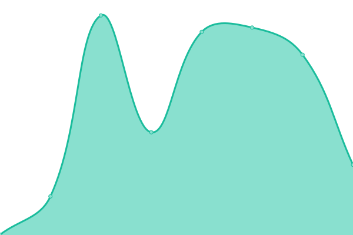
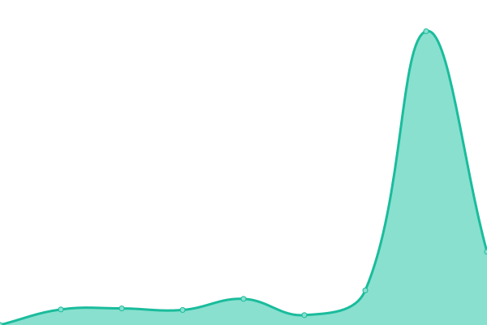
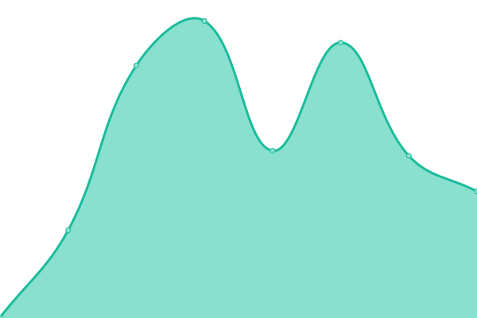

# [📈 Live Status](https://status.agencykahuna.com): <!--live status--> **🟩 All systems operational**

This repository contains the open-source uptime monitor and status page for [Upptime](https://upptime.js.org), powered by [Upptime](https://github.com/upptime/upptime).

With [Upptime](https://upptime.js.org), you can get your own unlimited and free uptime monitor and status page, powered entirely by a GitHub repository. We use [Issues](https://github.com/upptime/upptime/issues) as incident reports, [Actions](https://github.com/Webdz-Co/upptime/actions) as uptime monitors, and [Pages](https://status.agencykahuna.com) for the status page.

<!--start: status pages-->
<!-- This summary is generated by Upptime (https://github.com/upptime/upptime) -->
<!-- Do not edit this manually, your changes will be overwritten -->
<!-- prettier-ignore -->
| URL | Status | History | Response Time | Uptime |
| --- | ------ | ------- | ------------- | ------ |
|  [agency](https://agencykahuna.com) | 🟩 Up | [agency.yml](https://github.com/Webdz-Co/upptime/commits/HEAD/history/agency.yml) | 

 283ms
     
 | 

<a href="https://status.agencykahuna.com/history/agency">100.00%</a>
    

|  [girlsinc](https://girlsinc-houston.org) | 🟩 Up | [girlsinc.yml](https://github.com/Webdz-Co/upptime/commits/HEAD/history/girlsinc.yml) | 

 288ms
     
 | 

<a href="https://status.agencykahuna.com/history/girlsinc">100.00%</a>
    

|  [cookieco](https://gettysburgcookieco.com) | 🟩 Up | [cookieco.yml](https://github.com/Webdz-Co/upptime/commits/HEAD/history/cookieco.yml) | 

 227ms
     
 | 

<a href="https://status.agencykahuna.com/history/cookieco">100.00%</a>
    

|  [ntb](https://northtexasbankruptcy.com) | 🟩 Up | [ntb.yml](https://github.com/Webdz-Co/upptime/commits/HEAD/history/ntb.yml) | 

 241ms
     
 | 

<a href="https://status.agencykahuna.com/history/ntb">100.00%</a>
    

|  [rebecca](https://rebeccadturner.com) | 🟩 Up | [rebecca.yml](https://github.com/Webdz-Co/upptime/commits/HEAD/history/rebecca.yml) | 

 248ms
     
 | 

<a href="https://status.agencykahuna.com/history/rebecca">100.00%</a>
    

|  [harmony](https://harmonylandscapestudio.com) | 🟩 Up | [harmony.yml](https://github.com/Webdz-Co/upptime/commits/HEAD/history/harmony.yml) | 

 259ms
     
 | 

<a href="https://status.agencykahuna.com/history/harmony">100.00%</a>
    

|  [holistic](https://holisticquest.one) | 🟩 Up | [holistic.yml](https://github.com/Webdz-Co/upptime/commits/HEAD/history/holistic.yml) | 

 298ms
     
 | 

<a href="https://status.agencykahuna.com/history/holistic">100.00%</a>
    

<!--end: status pages-->

[**Visit our status website →**](https://status.agencykahuna.com)

## 📄 License

- Powered by: [Upptime](https://github.com/upptime/upptime)
- Code: [MIT](./LICENSE) © [Upptime](https://upptime.js.org)
- Data in the `./history` directory: [Open Database License](https://opendatacommons.org/licenses/odbl/1-0/)
